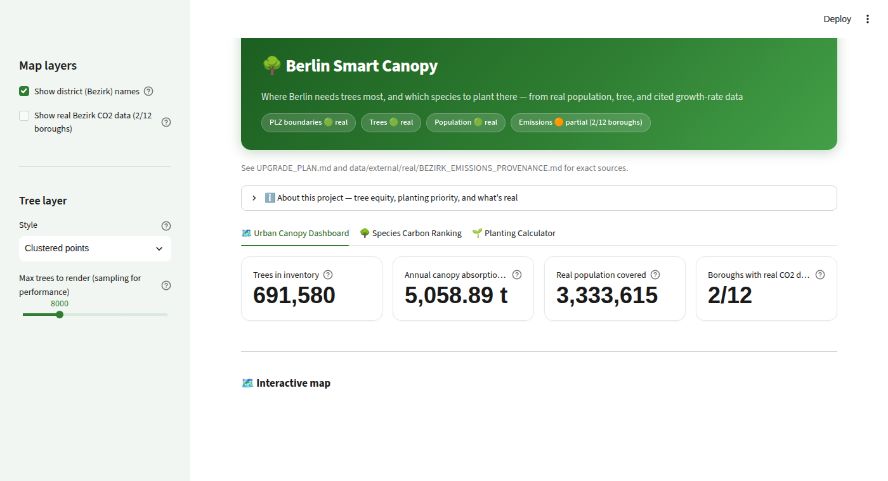
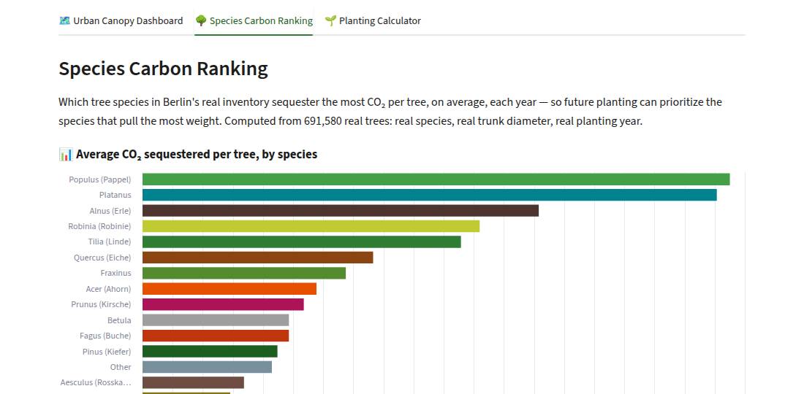

# Berlin Smart Canopy


A Streamlit app that answers two practical questions about Berlin's street trees using real data:
where does the city have the fewest trees relative to the people who live there, and which tree
species are worth planting more of because they pull more carbon out of the air per tree?

Everything the app shows — postal code boundaries, 691,580 individual trees, population figures,
borough emissions — is real Berlin/German data. Where the data runs out (Berlin, it turns out,
hasn't published a complete borough-level emissions dataset), the app says so instead of filling
the gap with a plausible-looking number. `METHODOLOGY.md` has the full breakdown of what's real,
what's a proxy estimate, and why.



## What it does

**Urban Canopy Dashboard.** A map of Berlin's real district boundaries and tree locations
(clustered points or a density heatmap, your choice), plus a table of every postal-code area
ranked by tree equity — population density against trees per 1,000 residents. Real published
borough-level CO2 data shows up here too, for the 2 of 12 boroughs Berlin has actually published a
figure for.

**Species Carbon Ranking.** This was the project's original idea: which tree species sequester the
most CO2, so planting can focus on them. Every species in the tree cadastre, ranked by average CO2
absorbed per tree per year — computed from real trunk diameter and age, combined with a growth-rate
classification sourced from a published USDA Forest Service / EPA method rather than a number
someone made up.



**Planting Calculator.** Pick a postal-code area, sketch a planting plan (species and count), and
see the projected change in that area's canopy carbon absorption by a target year. This is a
direct calculation, not a trained model — an earlier version used a Random Forest here, but its
training labels were generated by the same formula it was supposedly learning, so it was replaced
with the formula itself, called directly and transparently.

## How the rankings work, briefly

Planting priority is a z-score comparison — `z(population_density) - z(trees_per_1000_residents)`
— computed on real inputs only. Areas without a real population match are excluded rather than
guessed. Species carbon ranking comes from a proxy allometric formula (age, trunk diameter,
species) applied to real per-tree data. Full detail, including where the growth-rate numbers come
from and what's still an estimate, is in `METHODOLOGY.md`.

## Getting started

Requires Python 3.11+.

```bash
# Install dependencies
pip install -r requirements.txt

# Build real Berlin PLZ boundary geometry
python build_real_plz_geojson.py

# Stage real tree + PLZ data into data/raw
# (needs a real tree export — see data/external/real/README.md if you don't have one)
python data_generator.py

# Build features and train the priority-ranking model
python ml_engine.py

# Run the app
streamlit run app.py
```

The app opens at `http://localhost:8501`. It also needs `data/external/real/plz_einwohner.csv` —
a real nationwide PLZ/population lookup — in place; see `data/external/real/README.md` for what's
required versus optional.

## Project structure

```
Berlin-Carbon-Analysis/
├── app.py                      # The Streamlit app (3 tabs)
├── build_real_plz_geojson.py   # Builds real Berlin PLZ boundary geometry
├── data_generator.py           # Stages real tree + PLZ data into data/raw
├── ml_engine.py                # Feature engineering, KMeans training, artifact serialization
├── load_real_data.py           # Loaders for real trees / population / Bezirk emissions
├── METHODOLOGY.md              # Data sources, formulas, and what's still an estimate
├── requirements.txt
└── data/
    ├── external/real/          # Real source files (trees, population, Bezirk emissions)
    ├── raw/                    # Staged real CSV and GeoJSON
    ├── processed/              # Engineered features
    └── models/                 # Serialized KMeans pipeline and provenance metadata
```

## Built with

Python, Streamlit, Folium, and Altair for the app; GeoPandas and Shapely for the geospatial work;
scikit-learn (KMeans only — see `METHODOLOGY.md` for why there's no predictive model) and Pandas
for everything else.

## License

MIT — see `LICENSE`.
